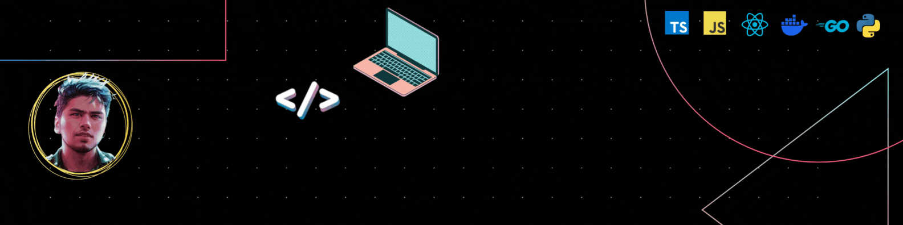

<!-- My Banner -->

<!-- About Me -->

# About Me

I am a **passionate full stack developer** with a deep enthusiasm for solving complex problems and building scalable solutions. With a natural curiosity, I continually seek out opportunities to explore and master new technologies. My goal is to create impactful software that not only solves real-world challenges but also pushes the boundaries of innovation.

## My Journey

I’ve always had a love for **learning**. Whether it's experimenting with the latest JavaScript frameworks or architecting server-side applications, I enjoy building projects that test my skills and allow me to create something meaningful. This drive has helped me become proficient in both **front-end** and **back-end** development, delivering full-featured applications from concept to completion.

### 🚀 DevOps Enthusiast

In addition to my full-stack expertise, I have a keen interest in **DevOps**. I believe that understanding how applications are deployed, monitored, and scaled is just as important as developing them. My current focus is on mastering DevOps tools and methodologies, particularly in **containerization**, **CI/CD pipelines**, and **infrastructure as code**.

### 💻 Golang: My New Love

Lately, I’ve been diving into **Golang** and loving its simplicity and performance. It’s a powerful language that allows me to write highly concurrent and scalable applications, perfect for modern cloud-based environments.

### ☁️ Cloud Skills

I am actively learning **AWS** (Amazon Web Services) to further enhance my cloud computing knowledge. Currently, I’m familiar with **S3**, **EC2**, and **Lambda**, and I’m continually expanding my expertise in cloud architecture to help build scalable, resilient applications. As I progress, I aim to leverage the full power of AWS to optimize application performance and reduce infrastructure costs.

<!-- ### 🛠️ Hobbies: Building Projects

When I’m not working, you’ll likely find me tinkering with **side projects**. Whether it’s a small app or an automation tool, building things from scratch is my way of keeping my skills sharp and exploring new ideas. These projects fuel my creativity and provide a sandbox where I can experiment with the latest technologies. -->

## 🧰 Tech Stack

Here are some of the tools and technologies that I work with:

-   **Frontend**:     
-   **Backend**:    
-   **Databases**:   
-   **DevOps**:   
-   **Cloud Platforms**:  (Familiar with - S3, EC2, Lambda)
-   **Other Tools**:   

## 🎯 My Vision

I’m constantly striving to **build great stuff**—software that is functional, efficient, and delightful to use. My ultimate goal is to keep growing, both as a developer and as a DevOps enthusiast, to contribute to projects that push the boundaries of what’s possible in technology.

I’m excited about what the future holds and can’t wait to tackle the next big challenge!

## 📞 Social

You can reach out to me on the following platforms:

  
  
  
  

